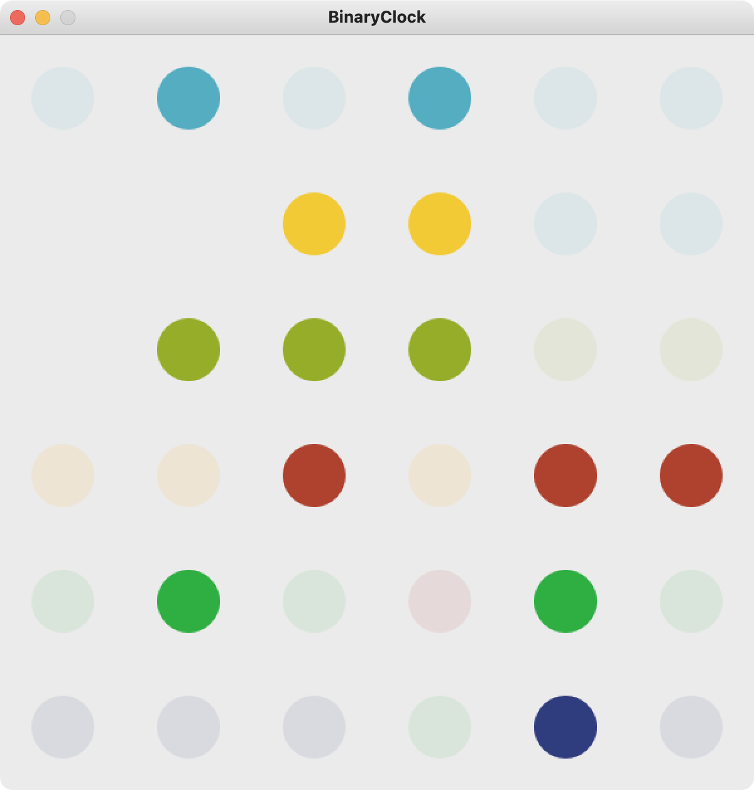
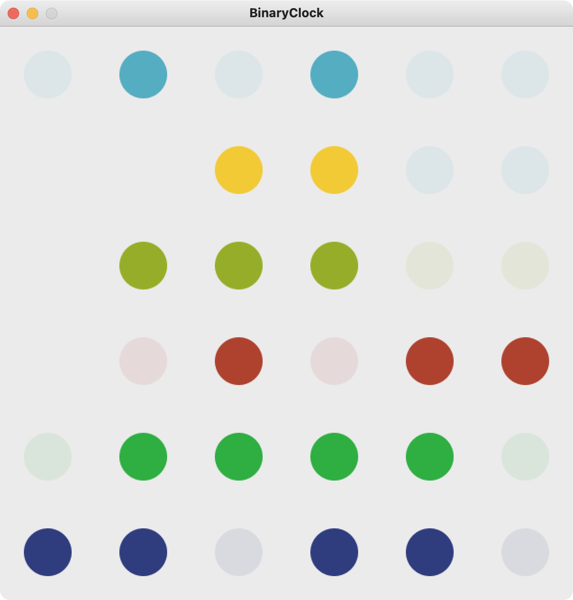

# Binary Clock

A basic binary clock built using Processing.

## Reading the Clock

The clock has a different colored row for each different reading of:

- Year (last 2 digits)
- Month
- Day (of the month)
- Hour
- Minute
- Second

For each row, using the lit up dots as `1`'s, and unlit dots as `0`'s, you read the row as a binary number, which represents the value of the row. For example:

- The year row is `010100`, which translated to base-10 is `20`, for the year 2020
- The month row is `1100`, which translated to base-10 is `12`, for the month of December
- The day row is `11100`, which translated to base-10 is 28, for the 28th of the month
- The hour row is `001011`
  - This is 12-hour format; the left-most dot is the AM/PM tag, and the rest of the digits represent the hour. In this case, with the PM light off, and the binary `01011`, the hour would be `11`, or 11 AM.
  - See below for the 24-hour format
- The minute row is `010010`, which translates to `18`
- The second row is `000010` which translates to `2`

Over all, the image preview represents the DT:

- 12 December 2020, at 11:18:02 AM

## 24-Hour Time

The main difference of 24-hour time is that on the hour row, there isn't an AM/PM dot at the end of the row, and it ranges from 0-23 on the row. To toggle 12/24-hour formats, see the configuration below.

## Configuration

Colors and the 12/24-hour mode can be changed within the `Constraints.pde` file.

- `BG` is the background color of the sketch.
- `IS_12_HOUR` determines whether to show the clock in 12-hour format (AM/PM) or 24-hour format.
- AMPM is the PM light for 12-hour time
- Below AMPM is each time row, and what color they should be
- Don't modify the values below the `// END CONFIGURATION //` tag. These are for calculating active and inactive colors for the clock lights.
